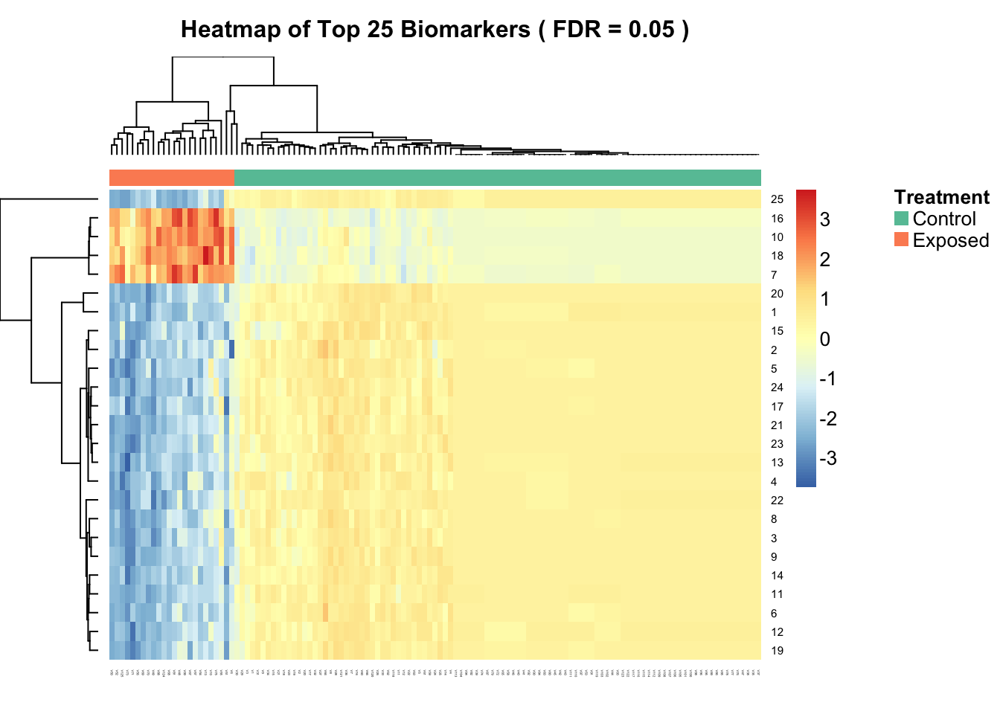

# Summary

The `biotmle` package provides an implementation of a biomarker discovery
methodology based on Targeted Minimum Loss-Based Estimation (TMLE) and a
generalization of the moderated t-statistic of [@smyth2005limma], designed for
use with biological sequencing data (e.g., microarrays, RNA-seq). The
statistical approach made available in this package relies on TMLE to
rigorously evaluate the association between a set of potential biomarkers and
another variable of interest (either an exposure or outcome), while adjusting
for potential confounding from another set of user-specified covariates. The
implementation provided here comes the form of a package for the R language for
statistical computing [@R].

The ...

\newpage

# References
